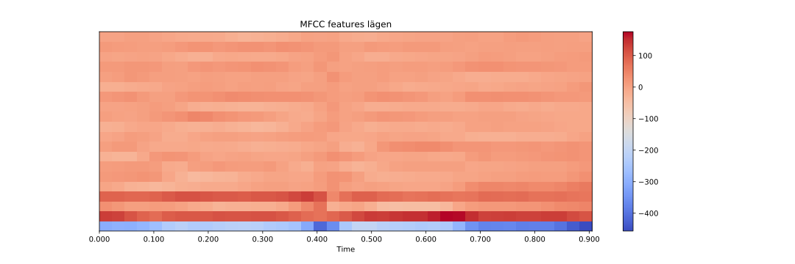
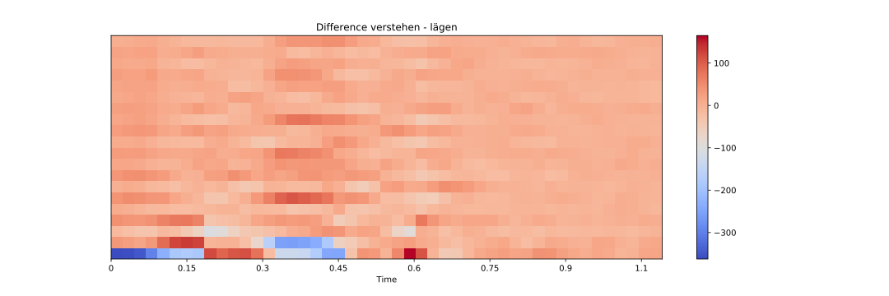
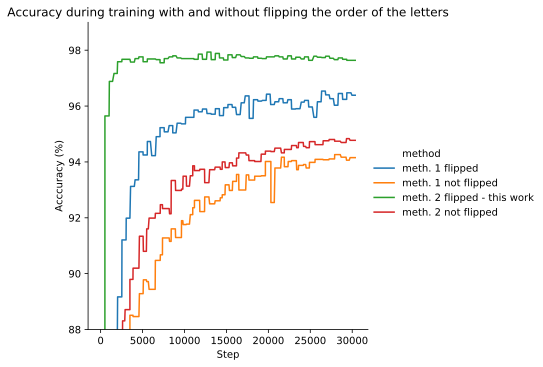
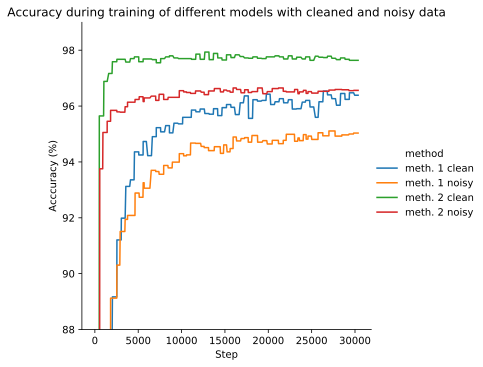
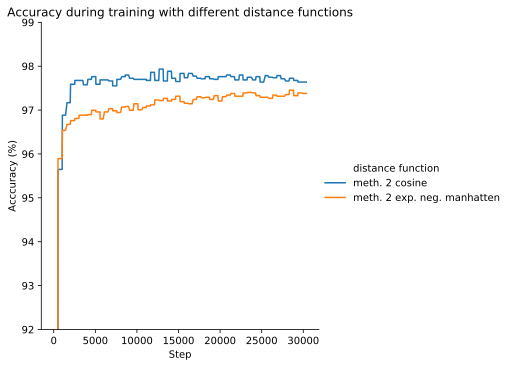

# Poetry Generation with large language models like GPT2 or GPT3
The core algorithm is model agnostic

## TL;DR
### The main project 
It consists out of an algorithm that tries to create metrically correct poetry that also rhymes in german language. It can be tried out by using a google colabs: colabs/poetry_generation. Unfortunately it takes a bit until all packages are installed. In the colab there is also a little description and showcase of the rythm and rhyme algorithms.  
Examples (cherry picked):  

(using gpt3) 

1)
Jetzt erschreck ich doch ein wenig eben 
dass das Ende bald geschlagen 
Wär es Aber ich will nicht sagen . 
dass ich einer von den Scheuen 
die nicht vor dem Sterben sich furcht 
Ich bin ich und meine Zeit zwar 
meine Zeit und sonst nichts weiter war . 
Also geh ich jetzt voll trost 

2)
Dies frage ich , denn alles , was ich sehe  
das scheint das scheint und nur weil ich es sehe , 
Ist es nicht so , dass lieber gar nichts wäre  
Doch nein ich will nicht nichts , ich will was sehen  
Ich will nicht nur nichts , ich will etwas seien  

There are also some interesting cases which indicate an (not perfect) awarness by the model about the letters inside of the tokens:  

(using german-poetry-gpt-2-large) 
A wie Apfelbaum , der Bäume ohne Kern hat 
B wie Brotfruchtbaum , ein Kern von bloßem Saume ist ; 
C wie Chlorus , der , wenn er im Meer begegnet 
Wenn er erst im Körper war , mit hundert facher Gier 
In den Grund des Wassers kriecht als wie zum lande 
D wie ölbaum , dessen Äste in der Wildnis sind , 
E wie Eichenbaum , der über die Erde hin eilt 
F wie Fäulnisbaum wenn aus den Büschen fahl und alt 
G wie neuer Kohlkopf , der im Treibhaus noch lebt 
H wie Hülstabaum , ein Baum der noch in Bäumen lebt 
O wie Polfußbaum der sich im Winde wiegt da 
O wie Rosenholz mit seinen gelben Blättern da 
S wie Silberrohr mit dicken Knöpfen drüber 
Aber der Baum der Wald bedeckt die weite Fläche nur 
S wie Seerücken über dem Meer das weit und breit ist  

### Two spin of projects
There are also two smaller projects that reflect on the combination between digital poetry using patterns and large language models 

in colabs/LLM_alliterations you find a colab that creates sentences in which the words begin with certain character patterns.  

Example:  
(german-poetry-gpt2-large): 
der dumpfe Drang des Daseins dich durch das Dasein durch die Dasein dauernd drängt 

(kant-gpt2-large) 
du durchschaust du durch das Dunkel des Denkens dich doch durchs Dasein dieser Dinge dir dein Dasein deutlich 
obiectiv seyn ohne Sinn oder Sinn ohne Substanz ohne Seele ohne Schönheit ohne system 

in colabs/llm_theo_lutz a colab can be found which creates sentences according to patterns using both, predefined patterns and large language models. It is loosely inspired by Theo Lutz, who programme an Zuse Z22 so that it creates poetry according to patterns form attributed words https://de.wikipedia.org/wiki/Theo_Lutz.  In this project a syntax was developed in order to define the patterns.  

Example:  
(kant-gpt2-large) 
du kannst nicht wünschen denn wir dürfen nicht verlangen 
es kann nicht finden denn ich muss suchen 
sie muss vorhergehen denn es darf wirken 

der erste Grad ist die Unlauterkeit denn der der Mensch ist nicht vollkommen 
die Ursache ist nicht die Wirkung denn der Grund ist blos denn die Ursache ist die Folge 
der Mensch ist nicht ein Zweck denn der Zweck mag seyn denn der Mensch ist nicht ein Thier 

er ist ein Recht denn die Gewalt ist eine Verbindlichkeit . er ist nie wirklicher denn der Mensch ist ein Weltwesen 
du bist ein Welttheil denn die Welt ist ein Platz . sie ist ein Begriff denn die Dinge sind nicht  

### Release of finetuned language models
Two models have been trained for this project and are released on huggingface: 
Anjoe/kant-gpt2-large  was trained on the "Akademie Ausgabe" for Kant
Anjoe/german-poetry-gpt2-large was trained on a corpus extracted from projekt gutenberg

### Rhyme and rythm models

Two models have been trained and released:  
sia_rhyme projects words into a 128 dimensional vector space in a way that rhyming words are closer to each other.  
ortho_to_ipa translates words into the IPA phonetic alphabet with symbols for secondary and primary word stress. This enables an algorithm to detect the rythm of the words. 

# The Algorithm

## Rhyme detection
### The corpus

As corpus we use the german rhyme corpus https://github.com/tnhaider/german-rhyme-corpus unfortunately the files that have been annotated are from the Deutsches Textarchiv in the TEI standard. Due to inconsistent usage of the TEI notation there might be noice introduced into the extracted dataset of rhyming and non rhyming word pairs. Additional to this the authors of the dataset also detected some noice due to annotation mistakes. https://www.aclweb.org/anthology/W18-4509/

### unsupervised rhyme detection
A method was introduced and tested in order to detect rhymes in an unsupervised way. Via text to speech (here amazon Polly is used) words are converted to audio files. From these the mfcc features are extracted with the librosa library. By comparing these mfcc features it is possible to detect rhymes. The method is validated on the noicy corpus mentioned above. An accuracy of 93% was detected.  

Below an example of the german words "verstehen" and "lägen" 

It is visible that the difference at the end of the words becomes more or less zero

### Siamese LSTM

#### The model
A Siamese LSTM was trained in order to create 128 dimensinal embeddings for a word. Words with less distance are more likely to rhyme then pairs with larger distance. As distance function the cosine between the two word vectors is used.  

As starting point an algorithm according to haider et al was implemented https://www.aclweb.org/anthology/W18-4509/ unfortunately this was difficult since the cited github code did not correspond with what they are describing in their paper. Also they state "For further experiments, we clean the entire set which reduces the total" (p. 82) which makes it difficult to reproduce their work. 

It was possible to reproduce their training curves, however it was found, that the model does not take into account the order of the letters. So "Katze" is very close to "zetka". 

Due to this issue synthetic data was created. Therefore rhyming pairs had been taken and the last letters(random number between 3 and 6) of the second word of each pair had been shuffled. By this process it is not guaranteed that the resulting words won't rhyme. Therefore the synthetic data was filtered with the unsupervised algorithm described above. After the synthetic data was added the algorithm of Haider et al performed significally lower. According to intution this could have to do something with the temporal average of the LSTM outputs. Therefore the architecture was changed in way that each output of the LSTM is fed into a fully connected layer without averaging it. This increased the performance a lot. Also, if the words are read from the right to left instead of the usual way the model would have the chance to learn that only the first (in the usual reading direction the last) letters are important. This indeed boosted the performance indeed a lot. 
It was observed that both methods suffer from indifference concerning flipped letters if no synthetic data was used. However the method of Haider et al. tent to prdouce this mistake even with the synthetic data. In the graphics the original LSTM implementation with temporal average is refferences as method 1, while the one without averaging is method 2. "flipped" is reffering to a flipped order of the letters so that the words are read from right to left. 

#### experiments with the corpus
Since the corpus has some noise the unsupervised method was used in order clean it up. This step is problematic since it only accepts the more or less obvious rhymes. In poetry sometimes also pairs that hardly rhymes is seen as a rhyme. However it was tested on a small dataset that the unsupervised method outperforms annotators that are no domain experts. Obviously two models only can be compared on the very same data. On the cleaned dataset the model presented here achives 97,8% accuracy. 
It could be argued that in the synthetic data words are present, that are also present in the non synthetic data. On the other hands this might be even harder for the model, since word pairs, that already have been detected as rhyming, are now non-rhyming pairs due to the shuffeled letters. The model was trained on both: A dataset, in which the rhyme pairs that have been used to create the synthetic data are removed from the corpus and one where the synthetic data is concatenated to the original corpus. Indeed the model that was trained on the dataset with the removed pairs performed better on the validation dataset. This is why it was not proceeded with this version but with the concatenated one in order to make it harder for the model to distinguish rhyming and not rhyming pairs.  

The model was trained on the noisy and the cleaned data and the relative distance between the models was still present. 

It was observed that the model does not perform as well as on the validation dataset on invented words that are hardly used in poems. In this project the binary classification is not as important, since the distances are measured between each word pair. However it is a valid question where this behaviour comes from. Either there is something suboptimal with the dataset or words that are used in poems have something in common which discrimantes them from words that have not been used in poems. This behaviour becomes worse with further training, so basically the model overfits on poetic language. 

It was tested how the training and accuracy loss behaves if duplicates from the training set are not removed and a high amount of the validation data is present in the training data. Although the validation accuracy of course increased, the relative difference between the different mehtods (method 1 and 2 with and without flipped words) remained the same. 

It was also tested to use the exponential negative manhatten distance function. This led to slightly less accuracy. 

## Rythm
A model was trained that translates words into the IPA phonetic alphabet with symbols for secondary and primary word stress. This enables an algorithm to detect the rythm of the words. The corpus of orthographic and IPA pairs was scraped from Wiktionary. It was only trained on german language. The accuracy is around 97% on the validation set. In order to get the rythm of the word, the words are split with pyphen in order to get the syllables. According to the signs for primary and secondary stress of the IPA language the syllables are labeled primary stressed (1) secondary stressed (0.5) and not stressed (0)

## The poem generation
### The language models
Two language models are used to generated the basis of the poems: a custom trained GPT2 and GPT3 which is accessed via the api. For GPT2 the large version of GPT2 was finetuned on data from projekt gutenberg. For masked langauge model a large version of BERT was used. It was also finetuned on the projekt gutenberg data but the results did not too much change compared to the not finetuned model. 

### Getting the correct rythm 
The poem is generated verse by verse. The language models produce around 10 different alternatives for each line. For these alternatives the rythm gets detected and the best fit is chosen. If only one sentence is produced and forwarded to the rythm correction spacy and bert have too much influence. This should be avoided since these are the two weakest links in the chain.  

If there is any output complying with the conditions it is forwarded to an algorithm that corrects the rythms. If the verse is too long it gets shortened. By creating an semantic tree with spacy it can be figured out which elements could get removed by keeping the syntactically and semantic integrity of the verse. If there are more options how to shorten the verse the one with the lowest perplexitiy (measured with GPT2) and best matching rythm is chosen. If the sentence is too short they are extended with a tandem of BERT and GPT2. BERT is suggesting different options where a metrically correct word could be inserted. GPT2 reads all the options and decides for the one with the lowest perplexity. If a word itself does not comply to the rythm, BERT looks for synonyms. In this case Spacy is used in order to get the labels for the word (if it is a verb etc.). If Spacy finds suggested synoyms that have the same lables they are preferred. Afterwards again GPT2 looks for the best option. 

### Finding rhyming pairs
After a verse is generated which rhyming partner already exists the algorithm looks for rhymes. For the first verse of the pair the task to produce alternatives is a bidirectional one since there is context on both sides of the end of the verse. For the second verse it is a causal langauge modelling task. Therefore the BERT - GPT2 tandem creates synonyms for the ending of the first verse, while the causal language model does so for the last verse. Afterwards the verse endings are embedded by the siamese rhyme model and the pair with the minimum distance is chosen. Also an algorithm is implemented that looks for rhymes by using colone phonetics https://de.wikipedia.org/wiki/Kölner_Phonetik since the output and processes of the model are saved this allows a comparison between the method in later studies. 

