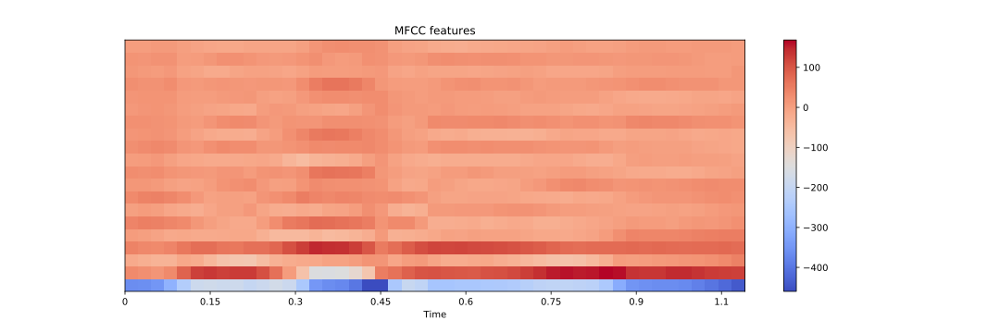

# Poetry Generation with large language models like GPT2 or GPT3
The core algorithm is model agnostic

## TL;DR
### The main project 
It consists out of an algorithm that tries to create metrically correct poetry that also rhymes in german language. It can be tried out by using a google colabs: colabs/poetry_generation. Unfortunately it takes a bit until all packages are installed. In the colab there is also a little description and showcase of the rythm and rhyme algorithms.  
Example:  

(using german-poetry-gpt-2-large) 
Zu tiefst im Menschen , daß sein Antlitz sich nicht  
Von seiner innern Schönheit scheiden möchte ? 
Ein Lächeln , von dem oft in blassen tagen 
Der Schein in blassen Zügen in den Augen 
Der Greise liegt , der in der Seele liegen 
Von sich versteckt , die ihm in Träumen lachen ! 
Ein Lächeln ist die Macht , die über die bahnen 
Der Menschen , selbst der Seelen , die in Aeonen 
Nicht weiterreichen , als des Himmels hallen 
Ein Lächeln ja , ein Lächeln ist sie allein , 
Des Mannes Blick , denn nur von ihm getragen 
Im Leben eines Menschen ist zugegen 
Die Macht , die über die Zeit und über jahrtausend 
Der Ahnen , die gesammt in ganzen Schaaren , 
An unsern Schultern hangen mit dem gleichen  

There are also some interesting cases which indicate an (not perfect) awarness by the model about the letters inside of the tokens:  

(using german-poetry-gpt-2-large) 
A wie Apfelbaum , der Bäume ohne Kern hat 
B wie Brotfruchtbaum , ein Kern von bloßem Saume ist ; 
C wie Chlorus , der , wenn er im Meer begegnet 
Wenn er erst im Körper war , mit hundert facher Gier 
In den Grund des Wassers kriecht als wie zum lande 
D wie ölbaum , dessen Äste in der Wildnis sind , 
E wie Eichenbaum , der über die Erde hin eilt 
F wie Fäulnisbaum wenn aus den Büschen fahl und alt 
G wie neuer Kohlkopf , der im Treibhaus noch lebt 
H wie Hülstabaum , ein Baum der noch in Bäumen lebt 
O wie Polfußbaum der sich im Winde wiegt da 
O wie Rosenholz mit seinen gelben Blättern da 
S wie Silberrohr mit dicken Knöpfen drüber 
Aber der Baum der Wald bedeckt die weite Fläche nur 
S wie Seerücken über dem Meer das weit und breit ist  

### Two spin of projects
There are also two smaller projects that reflect on the combination between digital poetry using patterns and large language models 

in colabs/LLM_alliterations you find a colab that creates sentences in which the words begin with certain character patterns.  

Example:  
(german-poetry-gpt2-large): 
der dumpfe Drang des Daseins dich durch das Dasein durch die Dasein dauernd drängt 

(kant-gpt2-large) 
du durchschaust du durch das Dunkel des Denkens dich doch durchs Dasein dieser Dinge dir dein Dasein deutlich
obiectiv seyn ohne Sinn oder Sinn ohne Substanz ohne Seele ohne Schönheit ohne system 

in colabs/llm_the_lutz a colab can be found which creates sentences according to patterns using both, predefined patterns and large language models. It is loosely inspired by Theo Lutz, who programme an Zuse Z22 so that it creates poetry according to patterns form attributed words. In this project a syntax was developed in order to define the patterns.  

Example:  
(kant-gpt2-large) 
du kannst nicht wünschen denn wir dürfen nicht verlangen 
es kann nicht finden denn ich muss suchen 
sie muss vorhergehen denn es darf wirken 

der erste Grad ist die Unlauterkeit denn der der Mensch ist nicht vollkommen 
die Ursache ist nicht die Wirkung denn der Grund ist blos denn die Ursache ist die Folge 
der Mensch ist nicht ein Zweck denn der Zweck mag seyn denn der Mensch ist nicht ein Thier 

er ist ein Recht denn die Gewalt ist eine Verbindlichkeit . er ist nie wirklicher denn der Mensch ist ein Weltwesen 
du bist ein Welttheil denn die Welt ist ein Platz . sie ist ein Begriff denn die Dinge sind nicht  

### Release of finetuned language models
Two models have been trained for this project and are released on huggingface: 
Anjoe/kant-gpt2-large  was trained on the "Akademie Ausgabe" for Kant
Anjoe/german-poetry-gpt2-large was trained on a corpus extracted from projekt gutenberg

### Rhyme and rythm models

Two models have been trained and released:  
sia_rhyme projects words into a 128 dimensional vector space in a way that rhyming words are closer to each other.  
ortho_to_ipa translates words into the IPA phonetic alphabet with symbols for secondary and primary word stress. This enables an algorithm to detect the rythm of the words. 

# The Algorithm

## Rhyme detection
### The corpus

As corpus we use the german rhyme corpus https://github.com/tnhaider/german-rhyme-corpus unfortunately the files that have been annotated are from the Deutsches Textarchiv in the TEI standard. Due to inconsistent usage of the TEI notation there might be noice introduced into the extracted dataset of rhyming and non rhyming word pairs. Additional to this the authors of the dataset also detected some noice due to annotation mistakes. https://www.aclweb.org/anthology/W18-4509/

### unsupervised rhyme detection
A method was introduced and tested in order to detect rhymes in an unsupervised way. Via text to speech (here amazon Polly is used) words are converted to audio files. From these the mfcc features are extracted with the librosa library. By comparing these mfcc features it is possible to detect rhymes. The method is validated on the noicy corpus mentioned above. An accuracy of 93% was detected.  

